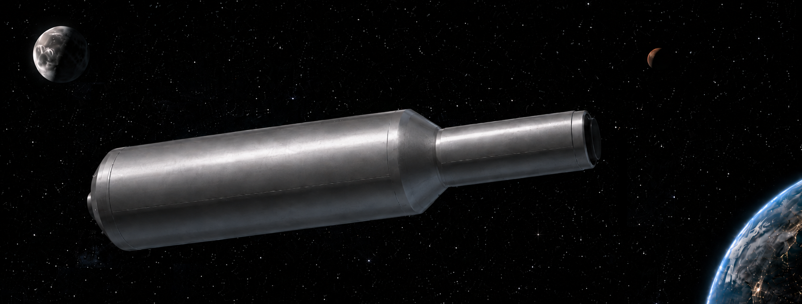

# Orbital Tender — Open Source Concept

A complete orbital tender — hull, internals, rigging, and the full animation pipeline — released for anyone to use, extend, or cite.

I designed and built this, but it didn't happen alone; a lifetime of support from family, friends, and cohorts made it possible. Consider it my argument that orbital logistics deserves to be taken seriously.

## Contents

`tender_rel_001.blend` (~35 MB) — Full Blender source file including:

- **Hull** — Complete exterior shell at real-world scale
- **Internals** — Payload bay structure, berthing mounts, central loader arm mechanism
- **Quadbot** — Maintenance drone model
- **Rigging** — Full armature with constraints for articulated elements
- **Animation pipeline** — Action strips, drivers, and scene setups
- **Lighting** — Studio lighting and camera angles matching renders on [highfrontierlogistics.com](https://highfrontierlogistics.com)

## Requirements

**Blender 4.3+** recommended. Earlier versions may lose compatibility with modifiers or animation data.

## License

This work is licensed under **CC BY-SA 4.0**.

You are free to:
- **Share** — copy and redistribute in any medium or format
- **Adapt** — remix, transform, and build upon it for any purpose, even commercially

Under these terms:
- **Attribution** — You must give appropriate credit: "High Frontier Logistics / Wesley E. Corp" — [highfrontierlogistics.com](https://highfrontierlogistics.com)
- **ShareAlike** — If you remix, transform, or build upon this material, you must distribute your contributions under the same license

Full license text: https://creativecommons.org/licenses/by-sa/4.0/

## Links

- [High Frontier Logistics](https://highfrontierlogistics.com) — thesis, renders, and project background
- [GitHub](https://github.com/wescorp/highfrontierlogistics) — infrastructure and operations repo
